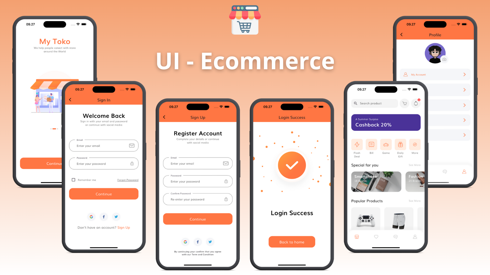

# 🛍️ Shop App - Aplikasi Belanja Flutter

**Shop App** adalah aplikasi belanja yang dibuat dengan Flutter, dirancang untuk memberikan pengalaman belanja yang mudah dan nyaman. Pengguna dapat melihat produk, menambahkannya ke keranjang, dan melanjutkan ke pembayaran dengan antarmuka yang menarik dan sederhana.

## 📱 Fitur Utama

- 🛒 **Daftar Produk**: Menampilkan berbagai produk dengan gambar, harga, dan deskripsi.
- 💳 **Keranjang Belanja**: Tambahkan produk ke keranjang dan lihat total belanja.
- 🛍️ **Checkout**: Lanjutkan ke proses pembayaran dengan ringkasan pesanan.
- 🔍 **Pencarian Produk**: Fitur pencarian untuk menemukan produk yang diinginkan dengan cepat.

## 📂 Struktur Proyek

- **lib/screens**: Berisi layar utama untuk daftar produk, detail produk, keranjang belanja, dan checkout.
- **lib/widgets**: Komponen UI seperti kartu produk, tombol, dan daftar belanja.
- **assets/images**: Gambar produk dan ikon aplikasi.

## 📸 Screenshot

Tampilan aplikasi Shop App:

## 🛠️ Teknologi yang Digunakan

- **Flutter**: Framework UI untuk membangun aplikasi lintas platform.
- **Dart**: Bahasa pemrograman untuk pengembangan aplikasi Flutter.

## ✨ Fitur Mendatang

- 🏷️ **Promo & Diskon**: Fitur untuk menampilkan promo dan diskon produk.
- 🔔 **Notifikasi**: Pemberitahuan untuk produk baru dan penawaran khusus.
- 🚚 **Pelacakan Pengiriman**: Melacak status pengiriman pesanan.

---

Terima kasih telah menggunakan **Shop App**! Selamat berbelanja! 🛒
